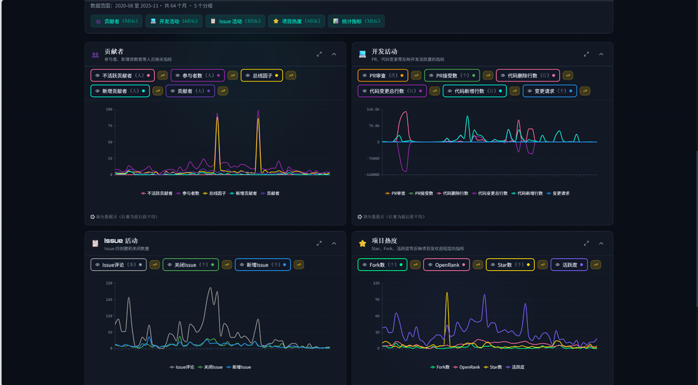
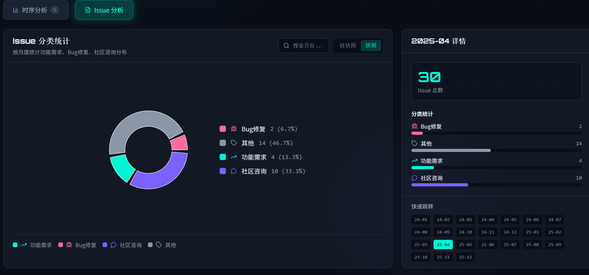
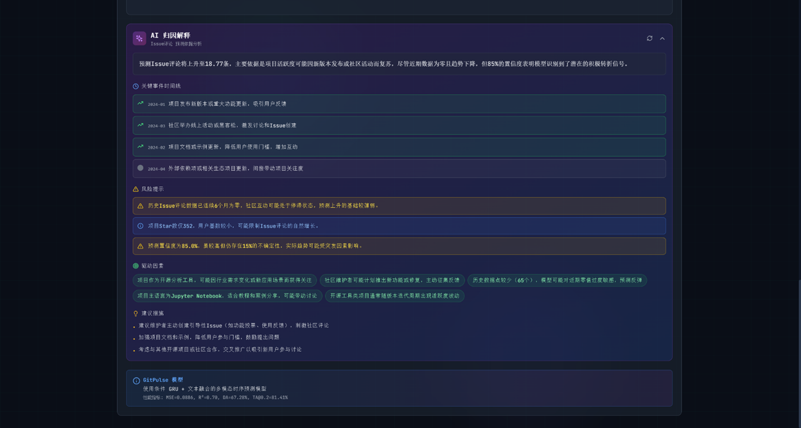
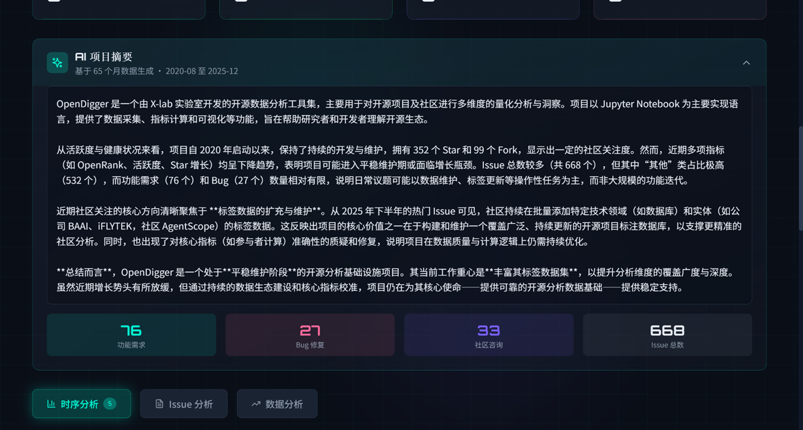

# OpenVista - GitHub 仓库生态画像分析平台

<div align="center">


**基于多模态时序预测的 GitHub 仓库生态画像分析平台**

[](https://www.python.org/)
[](https://reactjs.org/)
[](https://pytorch.org/)
[](LICENSE)

</div>

## 📖 项目简介

OpenVista 是一个基于多模态时序预测的 GitHub 仓库生态画像分析平台，通过融合时序指标和文本信息，实现对开源项目发展趋势的智能预测和分析。

### 核心特性

- 🎯 **多模态时序预测**：结合 16 个 OpenDigger 指标和文本信息（Issues、Commits）进行预测
- 🤖 **AI 智能问答**：基于 MaxKB 知识库的智能问答系统
- 📊 **可视化分析**：丰富的时序图表、Issue 分析和预测解释
- 🔮 **场景模拟**：支持假设参数调整，查看预测变化
- 📈 **高精度预测**：模型性能 MSE=0.0886, R²=0.70, DA=67.28%

## 🏗️ 技术架构


### 系统架构

```
OpenVista/
├── backend/                    # 后端服务 (Python Flask)
│   ├── Agent/                  # AI/MaxKB 层
│   │   ├── maxkb_client.py     # MaxKB AI 客户端
│   │   ├── deepseek_client.py  # DeepSeek API 客户端（备用）
│   │   ├── qa_agent.py         # 问答 Agent
│   │   └── prediction_explainer.py  # 预测解释生成器
│   │
│   ├── DataProcessor/          # 数据采集层
│   │   ├── crawl_monthly_data.py      # 主爬虫入口
│   │   ├── monthly_crawler.py         # 月度数据爬虫
│   │   ├── github_text_crawler.py     # GitHub 文本爬虫
│   │   ├── monthly_data_processor.py  # 数据处理器
│   │   ├── maxkb_uploader.py          # MaxKB 上传
│   │   └── data/                      # 爬取的数据
│   │
│   ├── GitPulse/               # 时序分析层（GitPulse 预测模块）
│   │   └── predictor.py        # GitPulse 预测适配器
│   │
│   ├── app.py                  # Flask API 入口
│   └── data_service.py         # 数据服务层
│
├── GitPulse/                   # GitPulse 核心模型
│   ├── model/                  # 模型定义
│   │   └── multimodal_ts_v4_1.py  # CondGRU+Text 模型
│   ├── predict/                # 预测脚本
│   │   ├── models/best_model.pt   # 训练好的模型权重
│   │   └── predict_single_repo.py
│   ├── training/               # 训练脚本
│   └── paper/                  # 论文相关
│
├── frontend/                   # 前端 (React + TypeScript + Tailwind)
│   └── src/
│       ├── App.tsx             # 主应用
│       └── components/         # UI 组件
│           ├── MultiMetricPrediction.tsx  # 多指标预测图表
│           ├── PredictionExplanation.tsx  # AI 归因解释
│           ├── ScenarioSimulator.tsx      # 场景模拟器
│           └── ...
│
└── get-dataset/                # 数据集生成工具
    ├── generate_training_dataset.py  # 数据集生成脚本
    └── README.md                # 数据集生成说明
```

## 🎯 功能模块

### 1. 数据采集层 (DataProcessor/)

从多个数据源采集仓库生态数据：

- **GitHub API**：爬取 Issues、PRs、Commits、Releases 等文本数据
- **OpenDigger**：获取 16 个时序指标（OpenRank、活跃度、Star数等）
- **数据组织**：按月份组织数据，生成时序数据
- **智能分类**：Issue 自动分类（功能需求/Bug修复/社区咨询）
- **AI 摘要**：生成项目总体摘要

### 2. AI/MaxKB 层 (Agent/)


智能问答和解释生成：

- **MaxKB 知识库问答**：基于项目文档的智能问答系统
- **项目摘要生成**：自动生成项目入门介绍
- **预测解释生成**：LLM 生成预测理由、关键事件、风险提示
- **DeepSeek 备用方案**：当 MaxKB 不可用时自动切换


### 3. 时序分析层 (GitPulse/)

**GitPulse 多模态时序预测模型**（条件 GRU + 文本融合）

- **多指标预测**：同时预测 16 个指标的未来走势（最多 32 个月）
- **文本融合**：结合项目描述、Issue 统计等文本信息
- **高精度预测**：模型性能优异


**支持的 16 个指标**：
- OpenRank、活跃度、Star数、Fork数、关注度、参与者数
- 新增贡献者、贡献者、不活跃贡献者、总线因子
- 新增Issue、关闭Issue、Issue评论
- 变更请求、PR接受数、PR审查

### 4. 前端展示层 (frontend/)


丰富的可视化界面：

- **首页**：输入仓库名，触发数据爬取和分析
- **时序分析**：展示 OpenDigger 指标的时序图表
- **单指标预测**：预测单个指标的未来趋势
- **多指标预测**：同时预测多个指标，双轴对比展示
- **场景模拟**：调整假设参数（如新增贡献者数量），查看预测变化
- **AI 归因解释**：LLM 生成预测理由、关键事件、风险提示
- **Issue 分析**：按月展示 Issue 关键词和分类









## 📊 模型性能


### GitPulse 模型性能指标

| 指标 | 数值 |
|------|------|
| **MSE** | 0.0886 |
| **R²** | 0.70 |
| **DA (Directional Accuracy)** | 67.28% |

### 模型优势

- ✅ **多模态融合**：结合时序指标和文本信息，提升预测精度
- ✅ **多指标联合预测**：同时预测 16 个指标，捕捉指标间关联
- ✅ **长期预测能力**：支持最多 32 个月的未来预测
- ✅ **场景模拟**：支持假设参数调整，探索不同发展路径

## 🚀 快速开始

### 环境要求

- Python 3.8+
- Node.js 16+
- npm 或 yarn

### 1. 克隆项目

```bash
git clone https://github.com/your-username/OpenVista.git
cd OpenVista
```

### 2. 环境配置

在项目根目录创建 `.env` 文件：

```env
# GitHub API Token（必需）
GITHUB_TOKEN=your_github_token

# 可选：多个 Token 轮换使用（提高速率限制）
GITHUB_TOKEN_1=token1
GITHUB_TOKEN_2=token2
# ... 最多支持 GITHUB_TOKEN_6

# MaxKB AI API（推荐，用于智能问答）
MAXKB_URL=http://localhost:8080
MAXKB_USERNAME=admin
MAXKB_PASSWORD=your_password
MAXKB_KNOWLEDGE_ID=your_knowledge_id

# MaxKB AI API（用于问答）
MAXKB_AI_URL=http://your-maxkb-server/api/application/{app_id}/chat/completions
MAXKB_API_KEY=your_maxkb_api_key

# DeepSeek API（备用）
DEEPSEEK_API_KEY=your_deepseek_api_key
```

### 3. 安装依赖

#### 后端依赖

```bash
cd backend
pip install -r requirements.txt
```

#### 前端依赖

```bash
cd frontend
npm install
```

### 4. 启动服务

#### 启动后端

```bash
cd backend
python app.py
```

后端将运行在 `http://localhost:5000`

日志文件位于 `backend/logs/openvista.log`

#### 启动前端

```bash
cd frontend
npm run dev
```

前端将运行在 `http://localhost:3000`

### 5. 访问应用

打开浏览器访问 `http://localhost:3000`

## 📖 使用指南

### 基本使用流程

1. **输入仓库信息**
   - 在首页输入仓库所有者和仓库名（如 `X-lab2017/open-digger`）
   - 点击"开始分析"按钮

2. **等待数据爬取**
   - 系统自动从 GitHub API 和 OpenDigger 爬取数据
   - 爬取过程会显示进度条

3. **查看数据分析**
   - 自动跳转到数据分析页面
   - 查看时序图表、Issue 分析等数据

4. **进行预测分析**
   - 在"数据分析"标签页选择预测模式：
   - **单指标预测**：选择一个指标进行详细预测
   - **多指标预测**：同时预测多个指标进行对比
   - **场景模拟**：调整假设参数查看影响

5. **查看 AI 解释**
   - 点击"AI 归因解释"查看预测理由
   - 查看关键事件和风险提示

### 示例仓库

我们以 **X-lab2017/open-digger** 作为示例仓库，该仓库包含：
- 65 个月的历史数据（2020-08 至 2025-12）
- 16 个 OpenDigger 指标
- 完整的 Issue 分类和文本数据

详细使用示例请参考：`GitPulse/EXAMPLE_X-lab2017_open-digger.md`

## 🔧 数据集生成

项目提供了完整的数据集生成工具，用于训练 GitPulse 模型。

### 数据集生成工具位置

```
get-dataset/
├── generate_training_dataset.py  # 数据集生成脚本
├── README.md                     # 详细使用说明
└── requirements.txt              # 依赖列表
```

### 快速使用

```bash
cd get-dataset
pip install -r requirements.txt

# 生成数据集（默认10000个仓库）
python generate_training_dataset.py --count 10000 --max-commits 30 --max-issues 50

# 从上次中断处继续
python generate_training_dataset.py --resume
```

### 数据集特性

- ✅ 每月爬取 30 个 commit + 50 个 issue（最多）
- ✅ **完整保留文本信息，不截断**
- ✅ 时间窗口采样（hist_len=48, pred_len=12, stride=6）
- ✅ Z-score 标准化预处理
- ✅ 支持批量爬取 10000+ 仓库
- ✅ 支持中断续传

详细说明请参考：[get-dataset/README.md](get-dataset/README.md)

## 📁 项目结构

```
OpenVista/
├── backend/                 # 后端服务
│   ├── Agent/              # AI/MaxKB 层
│   ├── DataProcessor/      # 数据采集层
│   ├── GitPulse/           # 时序分析层
│   ├── app.py              # Flask API 入口
│   └── data_service.py     # 数据服务层
│
├── frontend/               # 前端应用
│   ├── src/
│   │   ├── components/     # UI 组件
│   │   └── pages/         # 页面组件
│   └── package.json
│
├── GitPulse/               # GitPulse 核心模型
│   ├── model/              # 模型定义
│   ├── predict/            # 预测脚本
│   └── training/           # 训练脚本
│
├── get-dataset/            # 数据集生成工具
│   └── generate_training_dataset.py
│
├── image/                  # 项目图片资源
├── README.md               # 项目说明文档
└── requirements.txt        # Python 依赖
```

## 🛠️ 技术栈

### 后端技术

- **框架**：Flask (Python Web 框架)
- **深度学习**：PyTorch (模型训练和推理)
- **NLP**：Transformers (DistilBERT 文本编码)
- **数据处理**：Pandas, NumPy
- **API 客户端**：Requests

### 前端技术

- **框架**：React 18+ (UI 框架)
- **语言**：TypeScript (类型安全)
- **样式**：Tailwind CSS (原子化 CSS)
- **图表**：Recharts (数据可视化)
- **动画**：Framer Motion (交互动画)

### AI 技术

- **知识库**：MaxKB (RAG 问答系统)
- **大模型**：DeepSeek API (备用方案)
- **文本编码**：DistilBERT (文本特征提取)

### 数据源

- **GitHub API**：仓库数据（Issues、PRs、Commits、Releases）
- **OpenDigger**：时序指标数据（16 个指标）

## 📝 项目命名说明

| 名称 | 层级 | 说明 |
|------|------|------|
| **OpenVista** | 平台级 | 整个 GitHub 仓库生态画像分析平台 |
| **GitPulse** | 模型级 | 核心多模态时序预测模型（CondGRU+Text） |

## 🤝 贡献指南

欢迎贡献代码！请遵循以下步骤：

1. Fork 本项目
2. 创建特性分支 (`git checkout -b feature/AmazingFeature`)
3. 提交更改 (`git commit -m 'Add some AmazingFeature'`)
4. 推送到分支 (`git push origin feature/AmazingFeature`)
5. 开启 Pull Request

## 📄 许可证

本项目采用 MIT 许可证。详情请参阅 [LICENSE](LICENSE) 文件。

## 🙏 致谢

- [OpenDigger](https://github.com/X-lab2017/open-digger) - 提供时序指标数据
- [MaxKB](https://github.com/dataelement/bisheng) - 知识库问答系统
- [GitHub API](https://docs.github.com/en/rest) - 仓库数据源

## 📧 联系方式

如有问题或建议，请通过以下方式联系：

- 提交 Issue：[GitHub Issues](https://github.com/your-username/OpenVista/issues)
- 发送邮件：your-email@example.com

---

<div align="center">

**⭐ 如果这个项目对你有帮助，请给个 Star！⭐**

Made with ❤️ by OpenVista Team

</div>
