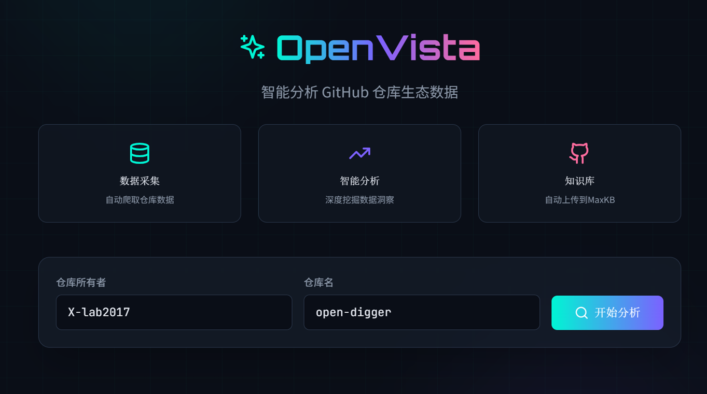
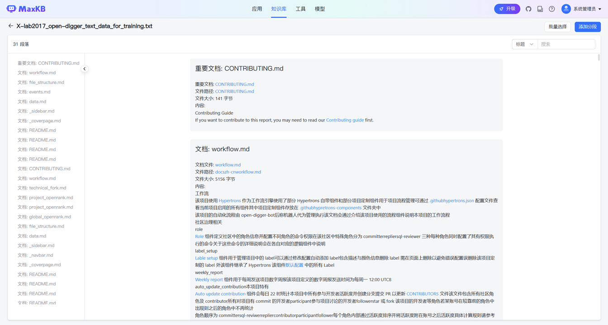
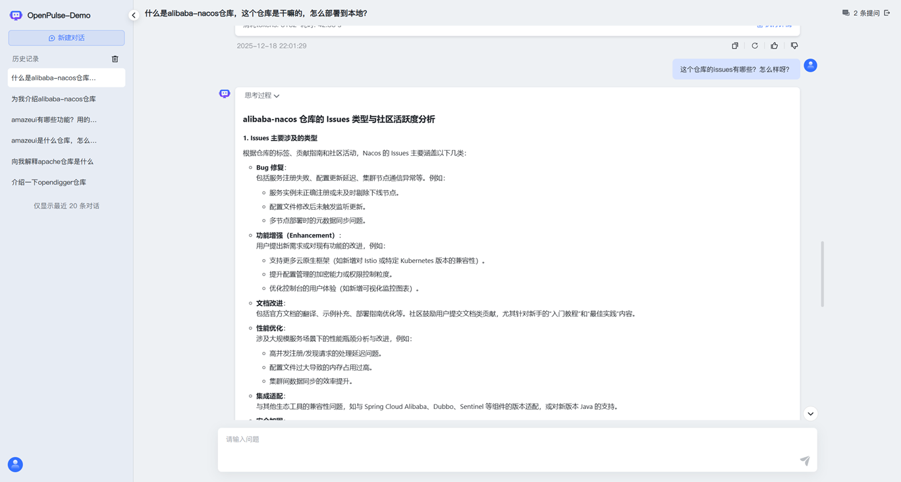
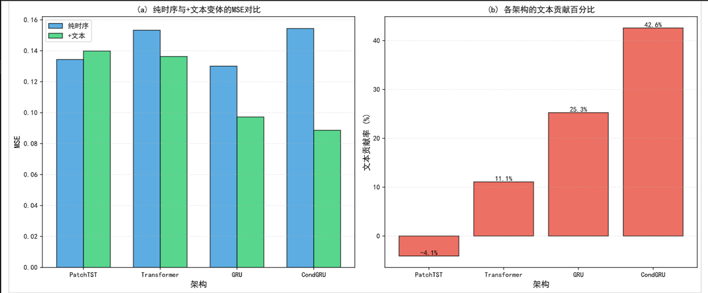
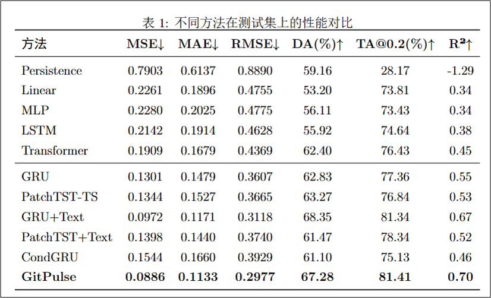
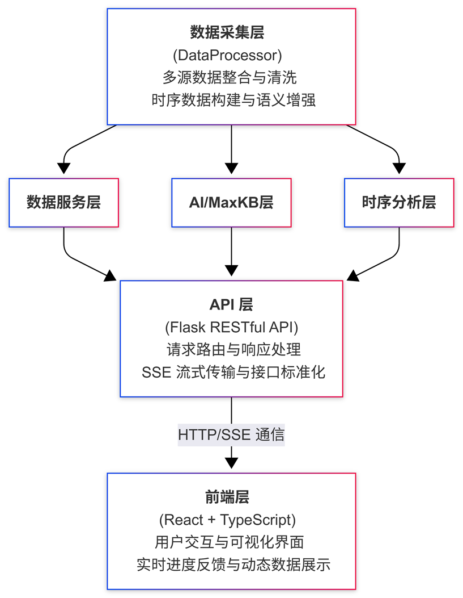

<div align="center">

# 🔮 OpenVista

### 基于多模态时序预测的 GitHub 仓库生态画像分析平台



<br/>

[](https://www.python.org/)
[](https://reactjs.org/)
[](https://pytorch.org/)
[](https://www.typescriptlang.org/)
[](LICENSE)

**[English](README.md)** · **[中文文档](README_CN.md)** · **[使用指南](使用指南（Q&A）.md)**

</div>

---

## 🌟 项目概述

**OpenVista** 是新一代开源项目健康度分析与预测平台。平台集成两大核心能力：

1. **🤖 MaxKB 智能问答系统** — 基于 RAG 技术的项目知识库问答
2. **🔮 GitPulse 多模态预测模型** — 融合时序指标与文本信息的智能预测

通过这两大核心模块，OpenVista 能够全方位分析开源项目的历史、现状与未来。

### ✨ 核心特性

| 功能 | 描述 |
|------|------|
| 🤖 **MaxKB 智能问答** | 基于项目文档的 RAG 知识库问答系统 |
| 🔮 **GitPulse 预测** | 时序指标 + 文本嵌入融合，预测未来 24 个月 |
| 📊 **CHAOSS 评估** | 社区健康度六维雷达图可视化评估 |
| 🔍 **相似仓库发现** | 基于 GitHub API 的多维度相似项目推荐 |
| 📈 **交互式可视化** | 精美图表，60+ 个月历史数据对比分析 |
| ⚡ **实时数据爬取** | 按需爬取任意 GitHub 仓库数据 |

---

## 🤖 MaxKB 智能问答系统

<div align="center">

</div>

### 系统架构

MaxKB 是 OpenVista 的 **AI 问答核心**，采用 **RAG（检索增强生成）** 技术，让用户可以自然语言询问关于项目的任何问题。

```
用户问题 → MaxKB 检索知识库 → LLM 生成回答 → 返回结果
```

### 知识库内容

系统自动为每个分析的仓库构建知识库，包含：

| 文档类型 | 内容说明 |
|----------|----------|
| 📄 **README** | 项目介绍、安装指南、使用说明 |
| 📜 **LICENSE** | 开源许可证信息 |
| 📁 **docs/** | 项目文档目录下的所有文档 |
| 📊 **项目摘要** | AI 生成的项目分析报告 |
| 🐛 **Issue 汇总** | 聚合的 Issue 数据和分类 |

### 技术栈与工具

| 组件 | 工具/技术 | 说明 |
|------|-----------|------|
| **知识库平台** | [MaxKB](https://github.com/1Panel-dev/MaxKB) | 开源 RAG 知识库系统 |
| **部署方式** | Docker Compose | 一键部署，支持数据持久化 |
| **向量数据库** | PostgreSQL + pgvector | 高效向量相似度检索 |
| **LLM 后端** | 可配置（DeepSeek/OpenAI 等） | 支持多种大模型 |

### 部署与配置

#### 方式一：使用预配置知识库（推荐）

```bash
cd maxkb-export

# 一键安装（含数据库备份恢复）
chmod +x install.sh
./install.sh
```

安装脚本会自动：
- 拉取 MaxKB Docker 镜像
- 创建数据卷并恢复预配置数据
- 启动服务在 `http://localhost:8080`

#### 方式二：全新安装

```bash
# 使用 Docker Compose 启动
docker-compose -f docker-compose.maxkb.yml up -d
```

#### 配置 .env 文件

```env
# MaxKB 服务配置
MAXKB_URL=http://localhost:8080
MAXKB_USERNAME=admin
MAXKB_PASSWORD=your_password
MAXKB_KNOWLEDGE_ID=your_knowledge_id

# MaxKB AI API（用于问答）
MAXKB_AI_URL=http://localhost:8080/api/application/{app_id}/chat/completions
MAXKB_API_KEY=your_maxkb_api_key
```

### 使用方式

1. **自动文档上传**：爬取仓库时自动将文档上传到 MaxKB
2. **智能问答**：在平台的 AI 问答模块中提问
3. **预测解释**：MaxKB 为预测结果生成可解释性分析

<div align="center">

</div>

---

## 🔬 GitPulse 预测模型

<div align="center">

</div>

### 模型概述

**GitPulse** 是 OpenVista 的核心多模态时序预测模型，能够同时预测 16 个 OpenDigger 指标的未来走势。

### 模型性能

<div align="center">

| 指标 | 数值 | 说明 |
|:----:|:----:|:-----|
| **MSE** | 0.0886 | 均方误差（越低越好） |
| **R²** | 0.70 | 决定系数 |
| **DA** | 67.28% | 方向准确率 |

</div>

<details>
<summary>📊 点击查看性能对比图</summary>

<div align="center">

</div>

</details>

### 架构亮点

| 组件 | 技术 | 作用 |
|------|------|------|
| **时序编码器** | 条件 GRU | 捕捉 16 个指标的时序模式 |
| **文本编码器** | DistilBERT | 提取项目描述、Issue 等文本特征 |
| **融合层** | 多模态融合 | 结合时序和文本信息 |
| **预测头** | MLP | 输出未来 12-24 个月的预测值 |

### 为什么需要多模态？

文本信息（Issues、README、Commits）提供了纯时序模型无法捕捉的上下文：
- 📢 即将发布的功能或重大变更
- 💬 社区讨论和情感倾向
- 🗺️ 项目路线图和优先级

### 支持的指标（共 16 个）

| 类别 | 指标 |
|------|------|
| **影响力** | OpenRank、Star 数、Fork 数、关注度 |
| **活跃度** | 活跃度、参与者数、新增贡献者 |
| **贡献者** | 贡献者数、不活跃贡献者、总线因子 |
| **Issue** | 新增 Issue、关闭 Issue、Issue 评论 |
| **PR** | 变更请求、PR 接受数、PR 审查 |

### 训练自己的模型

```bash
cd get-dataset

# 生成数据集（默认：10,000 个仓库）
python generate_training_dataset.py --count 10000

# 从中断处继续
python generate_training_dataset.py --resume
```

详细说明请参考 [get-dataset/README.md](get-dataset/README.md)。

---

## 🛠️ 技术架构

<div align="center">

</div>

<table>
<tr>
<td width="50%">

### 后端技术
- **框架**: Flask (Python)
- **深度学习**: PyTorch 2.0+
- **NLP**: Transformers (DistilBERT)
- **数据处理**: Pandas, NumPy

</td>
<td width="50%">

### 前端技术
- **框架**: React 18+ (TypeScript)
- **样式**: Tailwind CSS
- **图表**: Recharts + 自定义 SVG
- **动画**: Framer Motion

</td>
</tr>
<tr>
<td>

### AI 与知识库
- **RAG 系统**: MaxKB
- **LLM 备用**: DeepSeek API
- **文本编码**: DistilBERT

</td>
<td>

### 数据来源
- **GitHub API**: Issues、PRs、Commits
- **OpenDigger**: 16 个时序指标

</td>
</tr>
</table>

---

## 📁 项目结构

```
OpenVista/
├── 🔧 backend/                     # Flask 后端服务
│   ├── Agent/                      # AI 与 MaxKB 集成
│   │   ├── maxkb_client.py         # MaxKB 知识库客户端
│   │   ├── prediction_explainer.py # AI 预测解释器
│   │   └── qa_agent.py             # 智能问答 Agent
│   │
│   ├── DataProcessor/              # 数据爬取与处理
│   │   ├── crawl_monthly_data.py   # 主爬虫入口
│   │   ├── github_text_crawler.py  # GitHub 文本爬虫
│   │   ├── maxkb_uploader.py       # MaxKB 文档上传器
│   │   └── monthly_crawler.py      # OpenDigger 数据爬虫
│   │
│   ├── GitPulse/                   # GitPulse 预测模型
│   │   ├── model.py                # 模型架构定义
│   │   ├── prediction_service.py   # 预测服务
│   │   └── gitpulse_weights.pt     # 训练好的模型权重 (LFS)
│   │
│   ├── CHAOSSEvaluation/           # 社区健康度评分
│   │   └── chaoss_calculator.py    # CHAOSS 指标计算器
│   │
│   └── app.py                      # Flask API 入口
│
├── 🎨 frontend/                    # React 前端
│
├── 📊 get-dataset/                 # 训练数据集生成器
│
├── 🐳 maxkb-export/                # MaxKB 部署配置
│   ├── install.sh                  # 一键安装脚本
│   ├── docker-compose.yml          # Docker 编排文件
│   └── db/                         # 数据库备份
│
└── 📄 README.md
```

---

## 🚀 快速开始

### 环境要求

- Python 3.8+
- Node.js 16+
- Docker（用于 MaxKB）
- Git LFS（用于模型权重）

### 1️⃣ 克隆与初始化

```bash
# 克隆仓库
git clone https://github.com/your-username/OpenVista.git
cd OpenVista

# 初始化 Git LFS 并拉取模型权重
# Windows:
setup.bat
# Linux/Mac:
chmod +x setup.sh && ./setup.sh
```

### 2️⃣ 部署 MaxKB（可选但推荐）

```bash
cd maxkb-export
chmod +x install.sh
./install.sh
```

访问 `http://localhost:8080` 验证 MaxKB 运行正常。

### 3️⃣ 环境配置

在项目根目录创建 `.env` 文件：

```env
# 必需：GitHub API Token
GITHUB_TOKEN=your_github_token

# MaxKB 配置（如已部署）
MAXKB_URL=http://localhost:8080
MAXKB_USERNAME=admin
MAXKB_PASSWORD=your_password
MAXKB_KNOWLEDGE_ID=your_knowledge_id
MAXKB_AI_URL=http://localhost:8080/api/application/{app_id}/chat/completions
MAXKB_API_KEY=your_maxkb_api_key

# 可选：DeepSeek 作为 LLM 备用
DEEPSEEK_API_KEY=your_deepseek_key
```

### 4️⃣ 安装依赖

```bash
# 后端依赖
cd backend
pip install -r requirements.txt

# 前端依赖
cd ../frontend
npm install
```

### 5️⃣ 启动服务

```bash
# 终端 1：启动后端（端口 5000）
cd backend
python app.py

# 终端 2：启动前端（端口 3000）
cd frontend
npm run dev
```

### 6️⃣ 访问平台

打开浏览器访问 **http://localhost:3000**

---

## 📖 使用指南

### 基本流程

1. **🔍 搜索仓库** — 输入 `owner/repo`（如 `facebook/react`）
2. **⏳ 等待爬取** — 从 GitHub API 和 OpenDigger 获取数据
3. **📊 探索分析** — 查看时序图表、Issue 分析
4. **🔮 查看预测** — 查看 12 个月预测及 AI 解释
5. **📈 CHAOSS 评估** — 评估社区健康度评分
6. **🤖 AI 问答** — 使用 MaxKB 询问关于仓库的问题

---

## 🤝 贡献指南

欢迎贡献代码！请按以下步骤操作：

1. Fork 本仓库
2. 创建功能分支 (`git checkout -b feature/AmazingFeature`)
3. 提交更改 (`git commit -m 'Add AmazingFeature'`)
4. 推送到分支 (`git push origin feature/AmazingFeature`)
5. 发起 Pull Request

---

## 📄 许可证

本项目采用 **MIT 许可证**。详情请参阅 [LICENSE](LICENSE)。

---

## 🙏 致谢

- [MaxKB](https://github.com/1Panel-dev/MaxKB) — RAG 知识库系统
- [OpenDigger](https://github.com/X-lab2017/open-digger) — 时序指标数据来源
- [CHAOSS](https://chaoss.community/) — 社区健康度指标框架
- [GitHub API](https://docs.github.com/en/rest) — 仓库数据来源

---

<div align="center">

### ⭐ 如果这个项目对你有帮助，请给个 Star！⭐

<br/>

**Made with ❤️ by OpenVista Team**

*用预测智能赋能开源社区*

</div>
