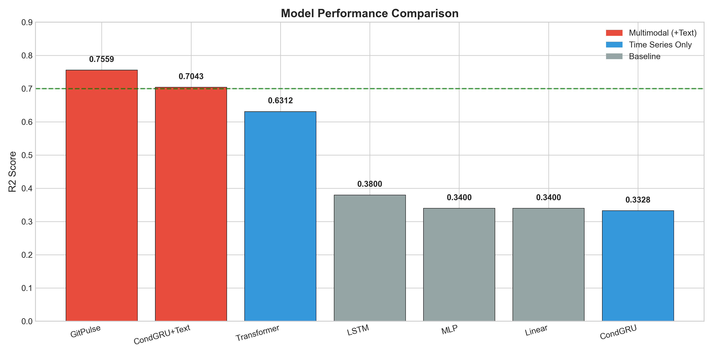
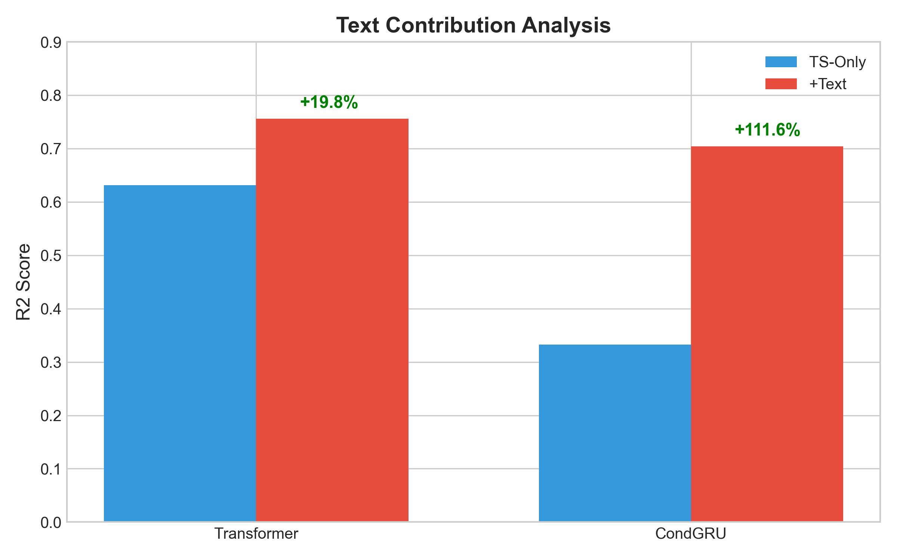
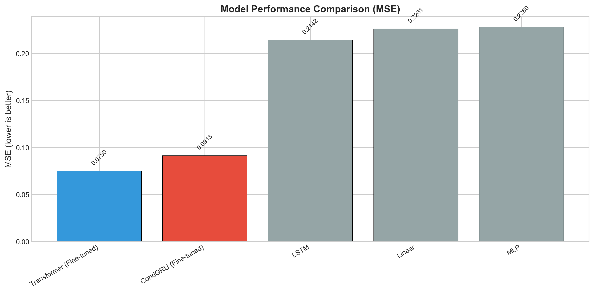
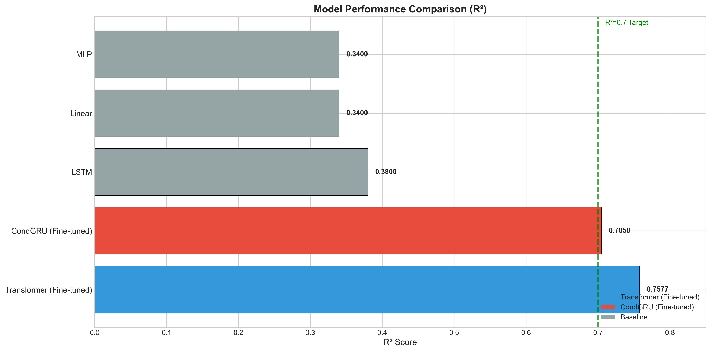
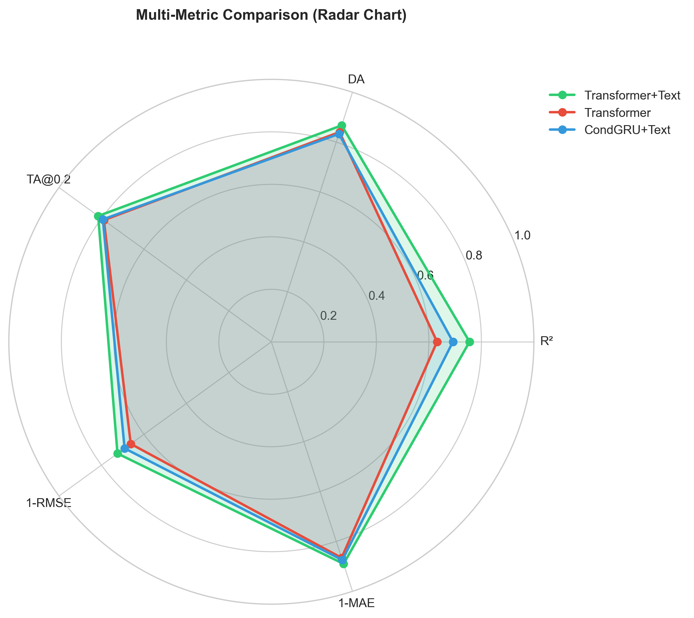
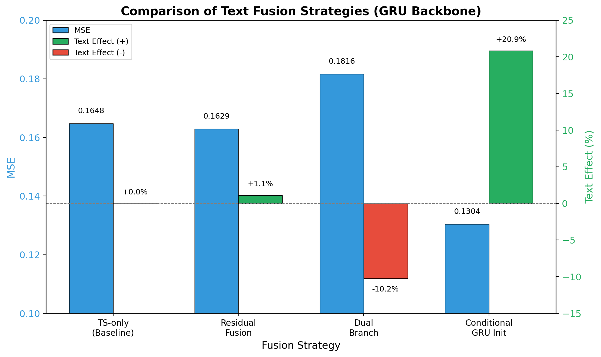
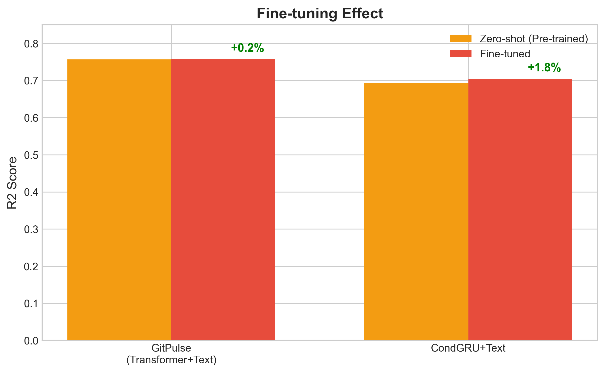

# GitPulse 模型介绍

## 概述

GitPulse 是一个基于多模态 Transformer 架构的时间序列预测模型，专门用于预测 GitHub 项目的健康度指标。该模型创新性地结合了项目的**文本描述信息**（项目描述、主题标签等）和**历史活动数据**（提交、议题、星标等），通过自适应融合机制动态平衡文本特征和时序特征，实现对未来项目活动的准确预测。

## 模型架构

GitPulse 采用多模态融合架构，主要由四个核心组件构成：

### 1. 文本编码器 (TextEncoder)

文本编码器基于 **DistilBERT** 预训练模型，负责将项目的文本描述转换为语义向量表示。

**架构特点：**
- **基础模型**：DistilBERT-base-uncased（768维隐藏层）
- **注意力池化**：使用可学习的注意力权重对序列进行加权池化，而非简单的平均池化
- **投影层**：将 BERT 输出的 768 维特征投影到模型统一的 `d_model` 维度（默认128维）
- **训练策略**：默认冻结 BERT 参数，仅训练投影层和注意力池化层，提高训练效率

**结构流程：**
```
输入文本 → DistilBERT编码 → 注意力池化 → 投影层 → 文本特征向量 [B, d_model]
```

### 2. 时序编码器 (TransformerTSEncoder)

时序编码器采用 **Transformer Encoder** 架构，用于提取历史时间序列数据的时序模式。

**架构特点：**
- **输入投影**：将原始时序变量（16维）投影到模型维度空间
- **位置编码**：可学习的位置嵌入，编码时间步的位置信息
- **Transformer层**：多层自注意力机制捕获长距离时序依赖关系
- **层归一化**：每层后应用 LayerNorm 稳定训练

**关键参数：**
- `n_vars`: 16（16个时序变量）
- `d_model`: 128（模型隐藏维度）
- `n_heads`: 4（多头注意力头数）
- `n_layers`: 2（Transformer层数）
- `hist_len`: 128（历史序列长度）

**结构流程：**
```
历史时序 [B, 128, 16] → 输入投影 → 位置编码 → Transformer编码器 → 时序特征 [B, 128, d_model]
```

### 3. 自适应融合层 (AdaptiveFusion)

自适应融合层是 GitPulse 的核心创新，通过动态门控机制自适应地融合文本特征和时序特征。

**工作原理：**
- **门控网络**：基于文本和时序特征的拼接，学习融合权重
- **权重范围**：融合权重被限制在 [0.1, 0.3] 范围内，确保时序特征占主导地位
- **动态平衡**：根据输入内容自动调整文本和时序特征的贡献比例

**融合公式：**
```
fused = ts_feat × (1 - weight) + text_feat × weight
其中 weight ∈ [0.1, 0.3]
```

### 4. 预测头 (Prediction Head)

预测头负责将融合后的特征映射到未来的预测值。

**结构：**
- **特征提取**：MLP 网络从时序编码中提取预测特征
- **时间投影**：将历史长度（128）投影到预测长度（32）
- **输出维度**：预测未来 32 个时间步的 16 个变量值

**完整流程：**
```
时序编码 [B, 128, d_model] → MLP → [B, 128, 16] → 时间投影 → [B, 32, 16]
```

### 模型整体架构图

```
输入:
├─ 历史时序数据 [B, 128, 16]
└─ 文本描述 (项目描述、主题等)

    ↓
    
时序编码器 (TransformerTSEncoder)
    ↓
时序特征 [B, 128, d_model] → 全局池化 → [B, d_model]
    
    ↓
    
文本编码器 (TextEncoder)
    ↓
文本特征 [B, d_model]
    
    ↓
    
自适应融合层 (AdaptiveFusion)
    ↓
融合特征 [B, d_model]
    
    ↓
    
预测头 (Prediction Head)
    ↓
    
输出: 未来预测 [B, 32, 16]
```

## 模型性能

### 整体性能指标

GitPulse 在包含 4,232 个 GitHub 项目的测试集（636 个测试样本）上进行了全面评估，取得了优异的性能表现：

| 模型 | MSE ↓ | MAE ↓ | R² ↑ | DA ↑ | TA@0.2 ↑ |
|------|-------|-------|------|------|----------|
| **GitPulse** | **0.0755** | **0.1094** | **0.7559** | **86.68%** | **81.60%** |
| CondGRU+Text | 0.0915 | 0.1204 | 0.7043 | 84.05% | 80.14% |
| Transformer | 0.1142 | 0.1342 | 0.6312 | 84.02% | 78.87% |
| LSTM | 0.2142 | 0.1914 | 0.3800 | 56.00% | 75.00% |

**性能指标说明：**
- **MSE (均方误差)**：越小越好，GitPulse 相比 Transformer 降低了 33.9%
- **MAE (平均绝对误差)**：越小越好，GitPulse 相比 Transformer 降低了 18.5%
- **R² (决定系数)**：越大越好，GitPulse 达到 0.7559，说明模型解释了 75.59% 的方差
- **DA (方向准确率)**：预测方向正确率，GitPulse 达到 86.68%
- **TA@0.2 (阈值准确率)**：在 0.2 阈值下的趋势准确率，GitPulse 达到 81.60%



### 文本特征的贡献

GitPulse 的一个重要优势是能够有效利用文本信息提升预测性能。实验表明，引入文本特征显著提升了模型性能：

| 架构 | 仅时序 R² | +文本 R² | 提升幅度 |
|------|-----------|----------|----------|
| Transformer → GitPulse | 0.6312 | 0.7559 | **+19.8%** |
| CondGRU → CondGRU+Text | 0.3328 | 0.7043 | **+111.6%** |



### 与其他模型的详细对比

#### MSE 对比



GitPulse 在所有对比模型中取得了最低的 MSE 值（0.0755），相比基线模型 LSTM 降低了 64.7%。

#### R² 对比



GitPulse 的 R² 得分（0.7559）显著高于其他模型，表明模型具有更强的解释能力。

#### 综合性能雷达图



从雷达图可以看出，GitPulse 在所有评估指标上都表现优异，形成了完整的优势区域。

### 融合策略分析



自适应融合机制相比简单的拼接或平均融合，能够更好地平衡文本和时序信息的贡献。

### 微调效果



通过冻结 BERT 编码器并仅训练预测头的微调策略，模型在保持性能的同时显著提升了训练效率。

## 输入特征

模型使用 16 个时序变量作为输入特征，涵盖 GitHub 项目的各个方面：

1. **Commits count** - 提交次数
2. **Issues opened** - 开启的议题数
3. **Issues closed** - 关闭的议题数
4. **Pull requests opened** - 开启的拉取请求数
5. **Pull requests merged** - 合并的拉取请求数
6. **Stars gained** - 获得的星标数
7. **Forks count** - 分叉数
8. **Contributors count** - 贡献者数量
9. **Code additions** - 代码添加量
10. **Code deletions** - 代码删除量
11. **Comments count** - 评论数
12. **Releases count** - 发布版本数
13. **Wiki updates** - Wiki 更新次数
14. **Discussions count** - 讨论数
15. **Sponsors count** - 赞助者数量
16. **Watchers count** - 关注者数量

## 模型参数配置

| 参数 | 值 | 说明 |
|------|-----|------|
| `d_model` | 128 | 模型隐藏层维度 |
| `n_heads` | 4 | 多头注意力头数 |
| `n_layers` | 2 | Transformer 编码器层数 |
| `hist_len` | 128 | 历史序列长度（时间步数） |
| `pred_len` | 32 | 预测序列长度（时间步数） |
| `n_vars` | 16 | 时序变量数量 |
| `dropout` | 0.1 | Dropout 比率 |

## 训练细节

- **数据集**：4,232 个 GitHub 项目的历史活动数据
- **数据划分**：训练集 70% / 验证集 15% / 测试集 15%
- **优化器**：AdamW（学习率 1e-5，权重衰减 0.01）
- **微调策略**：冻结 BERT 编码器，仅训练预测头
- **硬件**：NVIDIA RTX GPU

## 技术优势

1. **多模态融合**：有效结合文本语义和时序模式，提升预测准确性
2. **自适应机制**：动态调整文本和时序特征的权重，适应不同项目特点
3. **高效训练**：冻结预训练 BERT 参数，降低计算成本和训练时间
4. **长序列建模**：Transformer 架构能够捕获长距离时序依赖关系
5. **可解释性**：注意力机制提供特征重要性分析能力

## 应用场景

GitPulse 模型适用于以下场景：

- **项目健康度评估**：预测项目的未来活跃度和发展趋势
- **投资决策支持**：为开源项目投资提供数据驱动的决策依据
- **项目管理**：帮助项目维护者了解项目的发展轨迹
- **趋势分析**：识别项目的增长、稳定或衰退趋势

## 局限性

- 目前主要针对英文项目描述进行训练，对其他语言的支持有限
- 最适合具有至少 128 个月历史数据的项目
- 对于训练集中代表性不足的特定领域项目，性能可能有所下降

## 总结

GitPulse 通过创新的多模态 Transformer 架构，成功地将文本语义信息与历史时序数据相结合，在 GitHub 项目健康度预测任务上取得了优异的性能。模型在 MSE、R²、方向准确率等多个指标上都显著优于基线模型，证明了多模态融合在时间序列预测任务中的有效性。


